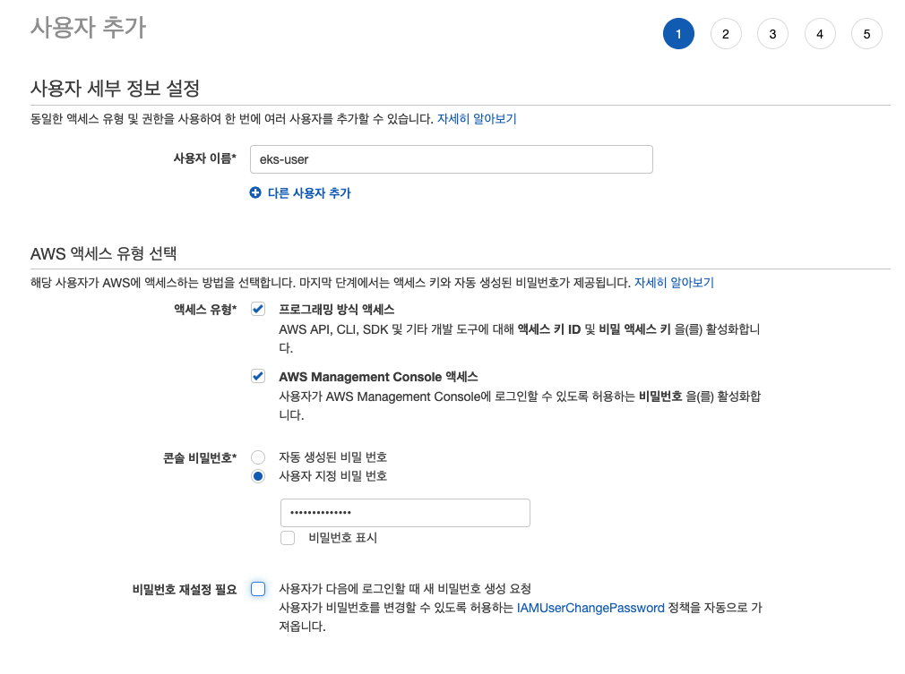
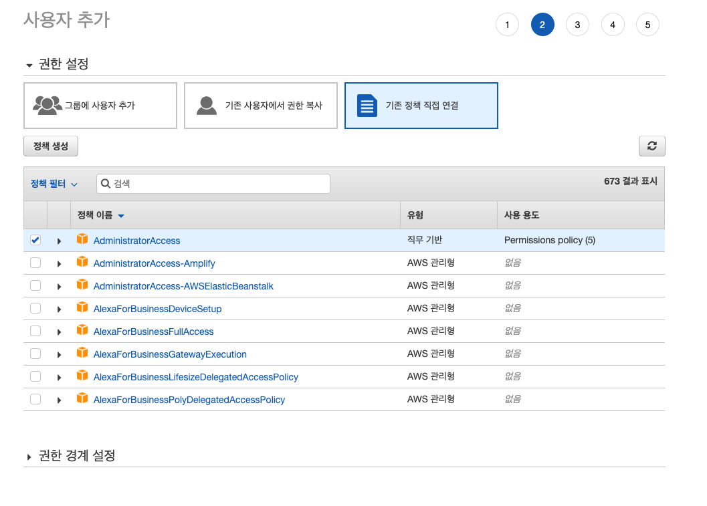
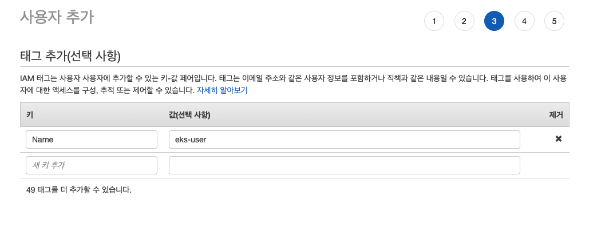
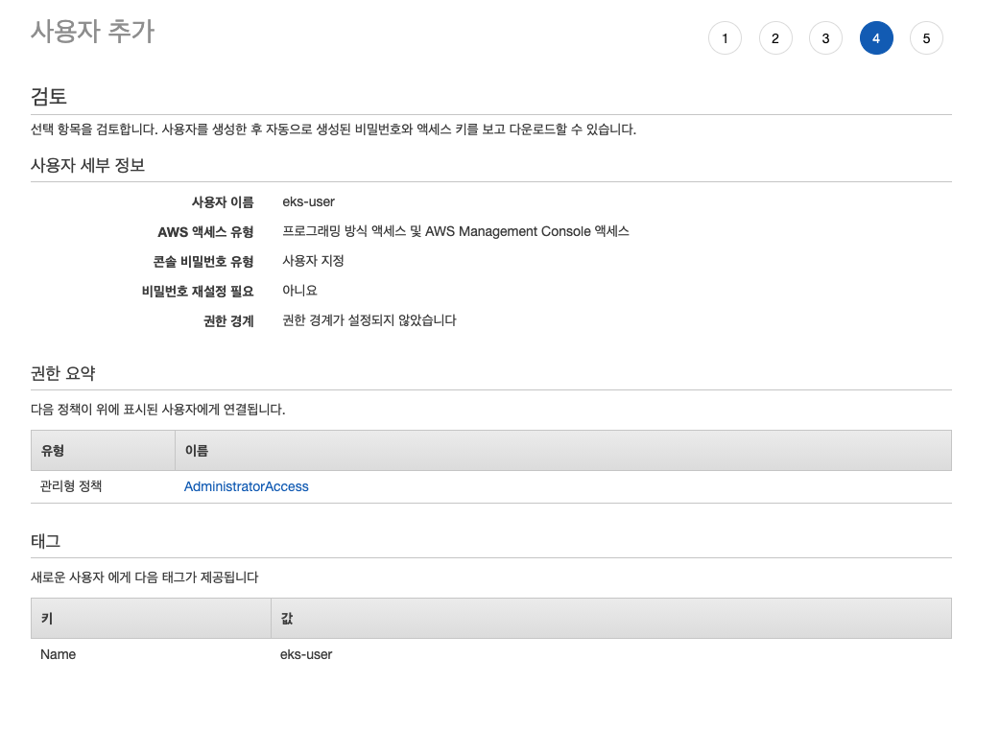
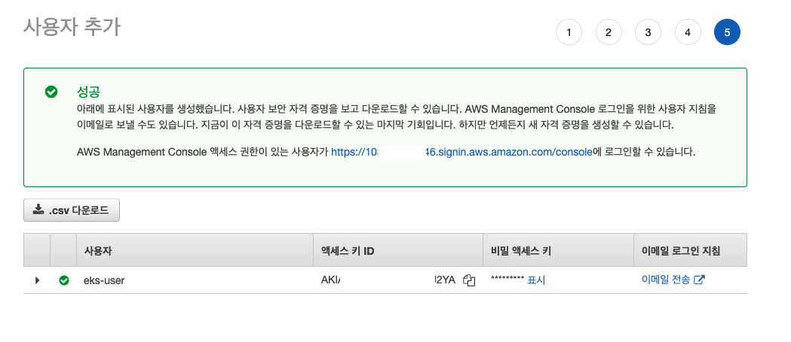
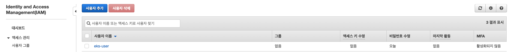

# EKS준비 - AWS 계정 생성

EKS를 설치하고 실행하기 위한 AWS계정을 생성한다. 

일반적으로 root 계정을 이용하는 것 보다, 특정 서비스를 위한 계정을 생성하는 것이 권장된다. 

## 작업순서

- AWS 계정 생성하기. 
- AWS 계정 권한 생성 및 부여 

## AWS 계정 생성하기. 

- root 혹은 admin 계정으로 로그인한다. 
- IAM > 사용자 > 사용자 추가 를 선택한다. 
  
### 사용자 이름 및 엑세스 방법 설정 

- 사용자 이름: eks-user
- 액세스 유형
  - 프로그래밍 방식 액세스: 체크
  - AWS Management Console 액세스: 체크 
- 콘솔 비밀번호: <비밀번호 입력>
- 비밀 번호 재설정 필요: <필요에 따라 체크>

### Role 추가 

- 권한 설정: 기존 정책 직접 연결 (기존 존재하는 정책을 그대로 이용할 것이기 때문에 이를 선택한다.)
- 정책: AdministratorAccess 를 선택한다. 

### 태그 추가 

### 검토 

### 시크릿 정보 다운로드 

## 확인 

위 결과를 통해서 우리는 EKS 운용을 위한 사용자를 생성했다. 

이 사용자는 콘솔로 접속해서 EKS의 리소스를 확인할 수 있고, 또한 CLI를 통해서 접근도 가능하다. 

