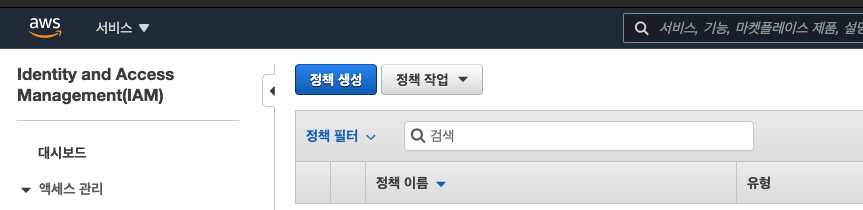
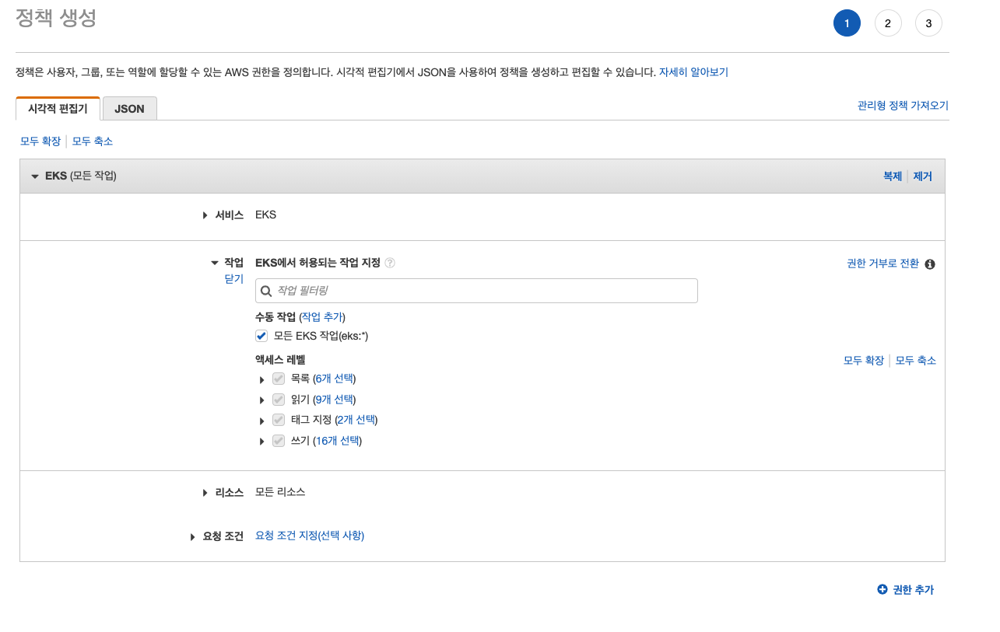
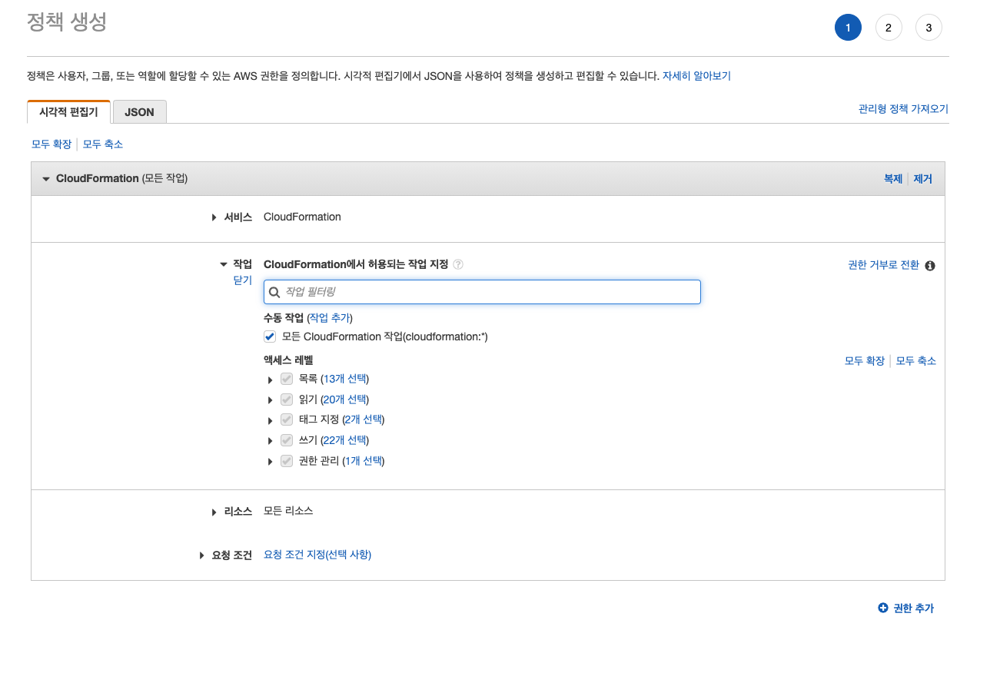
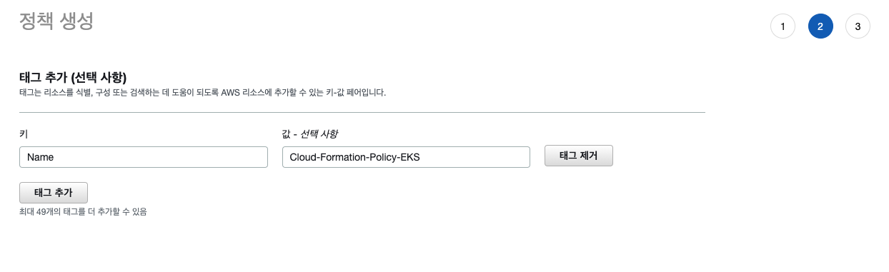
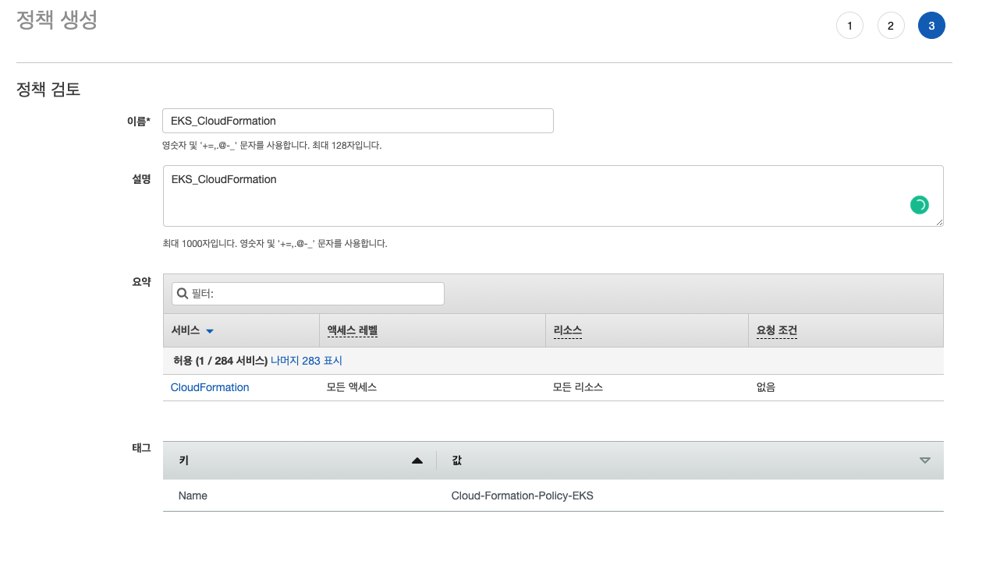
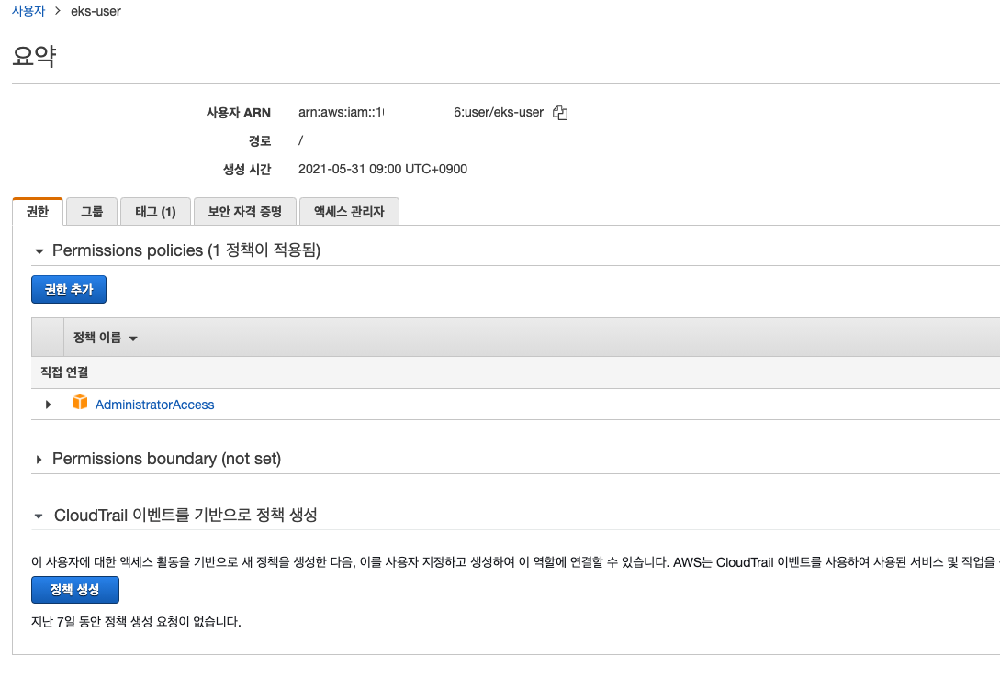
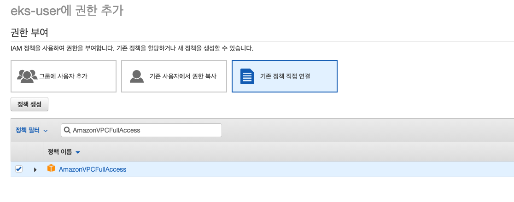
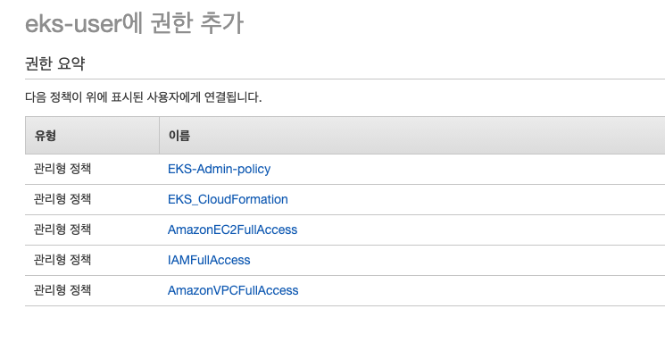
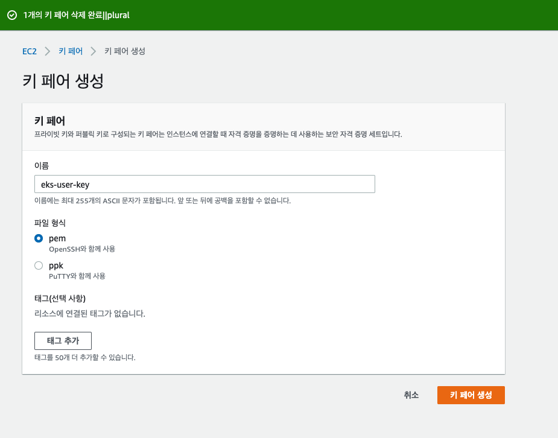

# AWS EKS 추가 정책 및 권한 부여하기. 
  

이제 AWS-EKS 사용자를 생성했으므로, 추가적인 권한을 생성해 주자. 

## 생성할 추가 권한 정보 

- eks 에 대한 접근 정책
- cloudformation 에 대한 정책
- AmazonEC2FullAccess
- IAMFullAccess
- AmazonVPCFullAccess

위와 같은 설정을 해보자. 

### EKS Admin 정책 생성하기. 

IAM > 정책 > 정책 생성을 선택한다. 

- 서비스: EKS
- 작업: 모든 EKS 작업 
- 리소스: 모든 리소스 

- 이름: EKS-Admin-Policy 

위와 같이 EKS-Admin 의 정책을 생성했다. 

### Cloudformation 정책 생성하기. 

이제 EKS 클러스터를 구성할때 사용하게될 Cloudformation 정책을 추가한다. 

IAM > 정책 > 정책 생성을 선택한다. 

- 서비스: CloudFormation
- 작업: 모든 CloudFormation 작업
- 리소스: 모든 리소스

- 이름: EKS_CloudFormation

이제 정책을 신규 생성했으므로, 다음과 같이 필요한 정책을 eks-user에 할당하자. 

### 정책 할당하기. 

IAM > 사용자 > eks-user 를 선택한다. 

위 화면에서 "권한 추가" 를 선택한다. 

- 권한 부여: 기존 정책 직접 연결
- 적용권한 목록: 
  - EKS-Admin-policy: EKS 관리 정책, 이젼 섹션에서 생성한 정책이다. 
  - EKS_CloudFormation: CloudFormation 관리 정책, 이전 섹션에서 생성한 정책이다. 
  - AmazonEC2FullAccess: EC2 호스트에 접속할 수 있는 정책이다. 
  - IAMFullAccess: IAM관련 정책 
  - AmazonVPCFullAccess: VPC 네트워크 관련 정책 

위 화면과 같이 생성된 정책 목록을 확인할 수 있다. 

### 키쌍 생성하기. 

EKS 클러스터 생성시 해당 호스트에 접근할 수 있도록 keypair을 생성한다. 

EC2 > 키 페어 > "키 페어 생성" 을 선택한다. 

위와 같이 EC2에 접근할 키 페어를 만들어서 특정 디렉토리에 저장하자. 

## 지금까지 EKS를 위한 준비를 해 보았다. 

- AWS 사용자를 생성하고
- 사용자 시크릿도 생성해서 받았다.
- EKS 및 클러스터를 관리할 정책을 생성하고, eks-user에 할당 해 주었다.
- 그리고 마지막으로 키 쌍을 생성하고, 다운 받았다. 

이제 기본적인 준비 사항은 완료 되었다. 그럼 설치를 시도해 보자. 