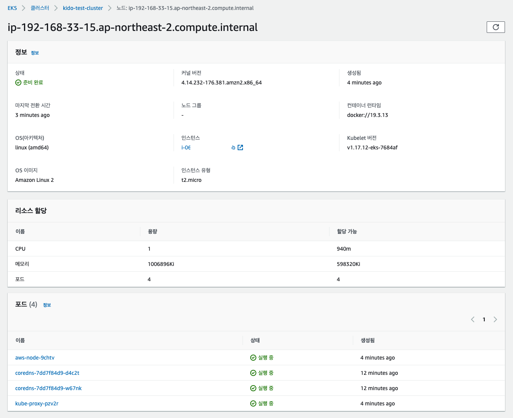

# Create EKS Cluster

이제 드디어 EKS Cluster 를 생성해 볼 차례이다. 

우리는 EKS 클러스터를 운영하기 위해서 eks-user를 생성하고, 해당 설정을 로컬에 지정해 주었다. 

EKS Cluster는 eksctl 을 이용하여 쉽게 생성할 수 있다. 

## eksctl 로 클러스터 생성하기. 

### 커맨드로 생성하기. 

```go
eksctl create cluster \
 --name kido-test-cluster \
 --version 1.17 \
 --region ap-northeast-2 \
 --node-type t2.micro \
 --nodes 2 \
 --nodes-min 2 \
 --nodes-max 4 \
 --profile eks-user
```

위 명령을 이용하여 클러스터를 생성해보자. 

- eksctl create cluster: 여기까지는 eks cluster를 생성하겠다는 의미이다. 
- '--name': cluster 이름을 지정한다. 여기서는 kido-test-cluster 으로 지정했다. 
- '--version': k8s의 버젼이다. 1.17로 지정했다. 
- '--region': 클러스터가 설치될 리젼을 말한다. ap-northeast-2 이므로 서울로 지정한다. 
- '--node-type': 클러스터 노드가 설치될 노드의 머신 타입이다. t2.micro 로 설정했다. 
- '--nodes': 최종 노드의 개수를 지정한다. 여기서는 2개를 지정했다. (기본은 2이다.)
- '--nodes-min': auto-scaling-group 에서 최소 노드 개수이다. (기본은 2이다.)
- '--nodes-max': auto-scaling-group 에서 최대 노드 개수이다. (기본은 2이다.)
- '--profile': 설치를 수행할 프로파일 정보를 지정한다. eks-user 의 권한으로 생성이 된다. 


### 참고: manifest 파일을 이용하여 생성하기. 

관련 메뉴얼은 다음에서 확인가능하다. : https://eksctl.io/usage/creating-and-managing-clusters/

aws 공식 메뉴얼: https://aws.amazon.com/ko/premiumsupport/knowledge-center/eks-multiple-node-groups-eksctl/

```go
eksctl create cluster \
 --dry-run \
 --name kido-test-cluster \
 --version 1.17 \
 --region ap-northeast-2 \
 --node-type t2.micro \
 --nodes 2 \
 --nodes-min 2 \
 --nodes-max 4 > create-cluster.yml
```

위 명령을 수행하면 yml 매니페스트 파일이 생성된다. 

생성된 파일은 다음 명령으로 실행이 가능하다. 

```go
eksctl create cluster -f create-cluster.yml
```

**create-cluster.yml 확인하기. ** 

```yaml
apiVersion: eksctl.io/v1alpha5
availabilityZones:
- ap-northeast-2b
- ap-northeast-2c
- ap-northeast-2d
cloudWatch:
  clusterLogging: {}
iam:
  vpcResourceControllerPolicy: true
  withOIDC: false
kind: ClusterConfig
metadata:
  name: kido-test-cluster
  region: ap-northeast-2
  version: "1.17"
nodeGroups:
- amiFamily: AmazonLinux2
  desiredCapacity: 2
  disableIMDSv1: false
  disablePodIMDS: false
  iam:
    withAddonPolicies:
      albIngress: false
      appMesh: false
      appMeshPreview: false
      autoScaler: false
      certManager: false
      cloudWatch: false
      ebs: false
      efs: false
      externalDNS: false
      fsx: false
      imageBuilder: false
      xRay: false
  instanceSelector: {}
  instanceType: t2.micro
  labels:
    alpha.eksctl.io/cluster-name: kido-test-cluster
    alpha.eksctl.io/nodegroup-name: ng-574821a7
  maxSize: 4
  minSize: 2
  name: ng-574821a7
  privateNetworking: false
  securityGroups:
    withLocal: true
    withShared: true
  ssh:
    allow: false
    enableSsm: false
  volumeIOPS: 3000
  volumeSize: 80
  volumeThroughput: 125
  volumeType: gp3
privateCluster:
  enabled: false
vpc:
  autoAllocateIPv6: false
  cidr: 192.168.0.0/16
  clusterEndpoints:
    privateAccess: false
    publicAccess: true
  manageSharedNodeSecurityGroupRules: true
  nat:
    gateway: Single

```

**생성 확인**

```go
2021-05-31 13:28:24 [ℹ]  eksctl version 0.52.0
2021-05-31 13:28:24 [ℹ]  using region ap-northeast-2
2021-05-31 13:28:24 [ℹ]  setting availability zones to [ap-northeast-2b ap-northeast-2c ap-northeast-2a]
2021-05-31 13:28:24 [ℹ]  subnets for ap-northeast-2b - public:192.168.0.0/19 private:192.168.96.0/19
2021-05-31 13:28:24 [ℹ]  subnets for ap-northeast-2c - public:192.168.32.0/19 private:192.168.128.0/19
2021-05-31 13:28:24 [ℹ]  subnets for ap-northeast-2a - public:192.168.64.0/19 private:192.168.160.0/19
2021-05-31 13:28:24 [ℹ]  nodegroup "ng-f3b89fc1" will use "ami-0fe33b69c98a70bc4" [AmazonLinux2/1.17]
2021-05-31 13:28:24 [ℹ]  using Kubernetes version 1.17
2021-05-31 13:28:24 [ℹ]  creating EKS cluster "kido-test-cluster" in "ap-northeast-2" region with un-managed nodes
2021-05-31 13:28:24 [ℹ]  will create 2 separate CloudFormation stacks for cluster itself and the initial nodegroup
2021-05-31 13:28:24 [ℹ]  if you encounter any issues, check CloudFormation console or try 'eksctl utils describe-stacks --region=ap-northeast-2 --cluster=kido-test-cluster'
2021-05-31 13:28:24 [ℹ]  CloudWatch logging will not be enabled for cluster "kido-test-cluster" in "ap-northeast-2"
2021-05-31 13:28:24 [ℹ]  you can enable it with 'eksctl utils update-cluster-logging --enable-types={SPECIFY-YOUR-LOG-TYPES-HERE (e.g. all)} --region=ap-northeast-2 --cluster=kido-test-cluster'
2021-05-31 13:28:24 [ℹ]  Kubernetes API endpoint access will use default of {publicAccess=true, privateAccess=false} for cluster "kido-test-cluster" in "ap-northeast-2"
2021-05-31 13:28:24 [ℹ]  2 sequential tasks: { create cluster control plane "kido-test-cluster", 2 sequential sub-tasks: { wait for control plane to become ready, create nodegroup "ng-f3b89fc1" } }

... 생략 

2021-05-31 13:40:28 [ℹ]  building nodegroup stack "eksctl-kido-test-cluster-nodegroup-ng-f3b89fc1"
2021-05-31 13:40:28 [ℹ]  deploying stack "eksctl-kido-test-cluster-nodegroup-ng-f3b89fc1"

... 생략 

2021-05-31 13:45:45 [✔]  saved kubeconfig as "/Users/kido/.kube/config"
2021-05-31 13:45:45 [ℹ]  no tasks
2021-05-31 13:45:45 [✔]  all EKS cluster resources for "kido-test-cluster" have been created
2021-05-31 13:45:45 [ℹ]  adding identity "arn:aws:iam::103382364946:role/eksctl-kido-test-cluster-nodegrou-NodeInstanceRole-1HCTUJIBI9B6V" to auth ConfigMap
2021-05-31 13:45:45 [ℹ]  nodegroup "ng-f3b89fc1" has 0 node(s)
2021-05-31 13:45:45 [ℹ]  waiting for at least 2 node(s) to become ready in "ng-f3b89fc1"
2021-05-31 13:46:17 [ℹ]  nodegroup "ng-f3b89fc1" has 2 node(s)
2021-05-31 13:46:17 [ℹ]  node "ip-192-168-33-15.ap-northeast-2.compute.internal" is ready
2021-05-31 13:46:17 [ℹ]  node "ip-192-168-81-250.ap-northeast-2.compute.internal" is ready
2021-05-31 13:46:18 [ℹ]  kubectl command should work with "/Users/kido/.kube/config", try 'kubectl get nodes'
2021-05-31 13:46:18 [✔]  EKS cluster "kido-test-cluster" in "ap-northeast-2" region is ready
```

### 생성과정 확인하기. 

위와같이 일련의 생성과정은 CloudFormation 을 통해서 생성되는 과정, 발생되는 이슈들을 상세히 확인할 수 있다. 

AWS Console에서 CloudFormation 리소스를 선택한다. 


그리고 우리가 설치하고 있는 클리스터 eksctl-kido-test-cluster-cluster 를 클릭하자.

상세 정보에서 "이벤트" 탭을 선택하면 상세한 설치 과정에 대한 로그를 확인할 수 있다. 


## 생성완료 확인하기. 

생성이 완료된경우 EKS 클러스터에서 내용을 확인할 수 있다. 

eks-user 로 aws console 에 접근한다. 

Elastic Kubernetes Service 를 검색하여 메뉴로 들어간다. 


보는바와 같이 "kido-test-cluster" 라는 클러스터가 생성되었ㄷ. 


- 위와 같이 2개의 노드를 생성했기 때문에 2개의 클러스터 노드가 생성되어 있음을 알 수 있다. 
- EKS의 경우 Master Control Plane은 사용자가 직접 접근하지 못하도록 하고 있다. (관리 주체는 AWS이다.)
- Worker Nodes 가 우리가 보는 노드이며, 이는 클러스터 관리자가 직접 관리할 수 있다. 



- 상세 노드를 위와 같이 확인할 수 있다. 

### kubectl 을 이용하여 클러스터 확인하기 

컨텍스트 확인하기. 

```go
kubectl config current-context

eks-user@kido-test-cluster.ap-northeast-2.eksctl.io
```

보는바와 같이 우리의 클러스터가 kubectl 에 정상적으로 세팅되어 있다. 

```go
kubectl get nodes

NAME                                                STATUS   ROLES    AGE   VERSION
ip-192-XXX-XXX-XX1.ap-northeast-2.compute.internal    Ready    <none>   15m   v1.17.12-eks-7684af
ip-192-XXX-XXX-XX2.ap-northeast-2.compute.internal    Ready    <none>   14m   v1.17.12-eks-7684af
```
 
 위와 같이 노드를 확인할 수 있다. 

### EKS Cluster 삭제하기. 

```go
eksctl delete cluster --name kido-test-cluster --profile eks-user
```

메니페스트를 이용하여 식제한다면 다음과 같이 수행할 수 있다. 

```go
eksctl delete cluster -f create-cluster.yml
```

## Wrapup

지금까지 우리는 eksctl 을 이용하여 클러스터를 생성하고, 삭제 해 보았다. 

간단히 dev환경으로 테스트할 경우에라면, eksctl 커맨드 라인을 이용하여 클러스터를 생성하면 된다. 

그러나 실제 프로덕에서는 manifesto파일을 생성하여 리소스를 직접 관리하는 것이 좋다. 
