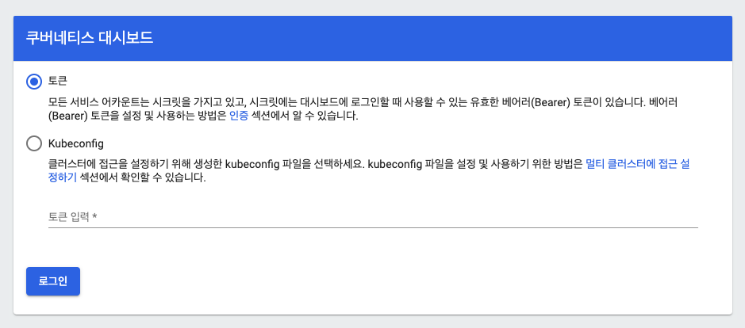
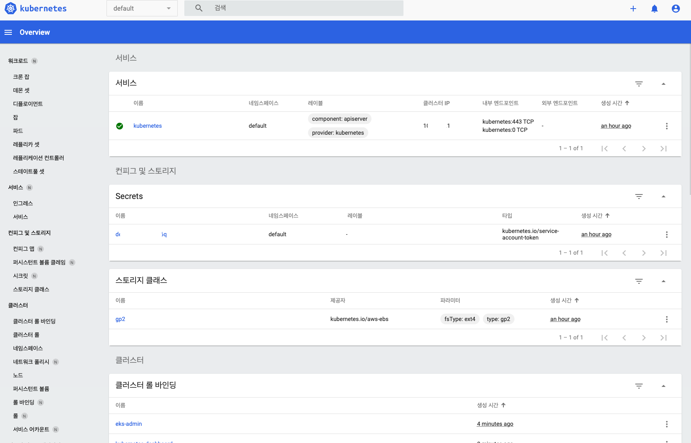

# Install Kubernetes Dashboard

쿠버네티스 대시보드를 생성해 보자. 

쿠버네티스 대시보드는 클러스터의 상태를 확인할 수 있고, 실제 Pod, Deployment 등을 배포하거나 컨트롤 할 수 있다. 

[관련정보](https://github.com/kubernetes/dashboard)

## 기본사항

- Kubernetes Dashboard 정보 
  - Workload(Deployments, Pods, ReplicationSets...)
  - Namespaces
  - Services
  - Nodes & Storage
  - Usage Metrics (Heapster monitoring 이 필요함)
- 커맨드 실행, RBAC 퍼미션을 기반으로 수행됨
- 보안
  - HTTPS
  - Bearer token을 통한 로그인
  - RBAC 로 UI Components 의 정교한 권한관리 

## 설치하기. 

```go
kubectl apply -f https://raw.githubusercontent.com/kubernetes/dashboard/v2.0.5/aio/deploy/recommended.yaml
```

위 명령을 통해서 kubernetes 에 적용하자. 

```go
namespace/kubernetes-dashboard created
serviceaccount/kubernetes-dashboard created
service/kubernetes-dashboard created
secret/kubernetes-dashboard-certs created
secret/kubernetes-dashboard-csrf created
secret/kubernetes-dashboard-key-holder created
configmap/kubernetes-dashboard-settings created
role.rbac.authorization.k8s.io/kubernetes-dashboard created
clusterrole.rbac.authorization.k8s.io/kubernetes-dashboard created
rolebinding.rbac.authorization.k8s.io/kubernetes-dashboard created
clusterrolebinding.rbac.authorization.k8s.io/kubernetes-dashboard created
deployment.apps/kubernetes-dashboard created
service/dashboard-metrics-scraper created
deployment.apps/dashboard-metrics-scraper created
```

위와 같이 필요한 서비스들이 배포 되었다. 

## 클러스터 롤 바인딩으로 eks-admin 서비스 연동 

[dashboard](https://docs.aws.amazon.com/ko_kr/eks/latest/userguide/dashboard-tutorial.html)

이제 kubernetes 대시보드 사용 권한을 부여하자. 

eks-admin-service-account.yaml 파일을 생성하고 다음과 같이 작업한다. 

```go
apiVersion: v1
kind: ServiceAccount
metadata:
  name: eks-admin
  namespace: kube-system
---
apiVersion: rbac.authorization.k8s.io/v1beta1
kind: ClusterRoleBinding
metadata:
  name: eks-admin
roleRef:
  apiGroup: rbac.authorization.k8s.io
  kind: ClusterRole
  name: cluster-admin
subjects:
- kind: ServiceAccount
  name: eks-admin
  namespace: kube-system
```

### 적용하기. 

```go
kubectl apply -f eks-admin-service-account.yaml

serviceaccount/eks-admin created
clusterrolebinding.rbac.authorization.k8s.io/eks-admin created
```

## 대시보드 Connect 생성하기. 

```go
kubectl -n kube-system describe secret $(kubectl -n kube-system get secret | grep eks-admin | awk '{print $1}')

Name:         eks-admin-token-dr74m
Namespace:    kube-system
Labels:       <none>
Annotations:  kubernetes.io/service-account.name: eks-admin
              kubernetes.io/service-account.uid: 061884c5-7bc8-4e5a-a966-adf4c1060be1

Type:  kubernetes.io/service-account-token

Data
====
ca.crt:     1025 bytes
namespace:  11 bytes
token: <token>
```

위와 같이 정보를 확인할 수 있다. 

### proxy 실행하기. 

```go
kubectl proxy
```

위와 같이 수행하면 127.0.0.1:8001 으로 접근이 가능하다. 

대시보드는 다음 경로로 접근한다. [http://localhost:8001/api/v1/namespaces/kubernetes-dashboard/services/https:kubernetes-dashboard:/proxy/#/login](http://localhost:8001/api/v1/namespaces/kubernetes-dashboard/services/https:kubernetes-dashboard:/proxy/#/login)



대시보드 화면이 나타나면, 조금전 조회한 token을 복사하여 붙여 넣자. 



대시보드 화면이 나타나는 것을 확인할 수 있다. 

## 참고정보: 

### Dashboard 접근 경오 :

Dashboard 는 다음 경로로 접근이 가능하다. 

```go
<hostname>:<port>/api/v1/namespaces/kube-system/services/https:kubernetes-dashboard:/proxy/
```

위와 같이 접근한다. 

이전에 생성한 방식으로 토큰을 생성하고, 입력한다. 

## WrapUp

지금까지 Dashboard 를 설치하는 방법을 알아 보았다. 

Dashboard이 수행하는 작업은 클러스터를 직접 관리할 수 있기 때문에, 접근 제한이 필요하다. 

접근을 위해서 토큰을 받아서 대시보드에 접근한 것을 확인하자. 


